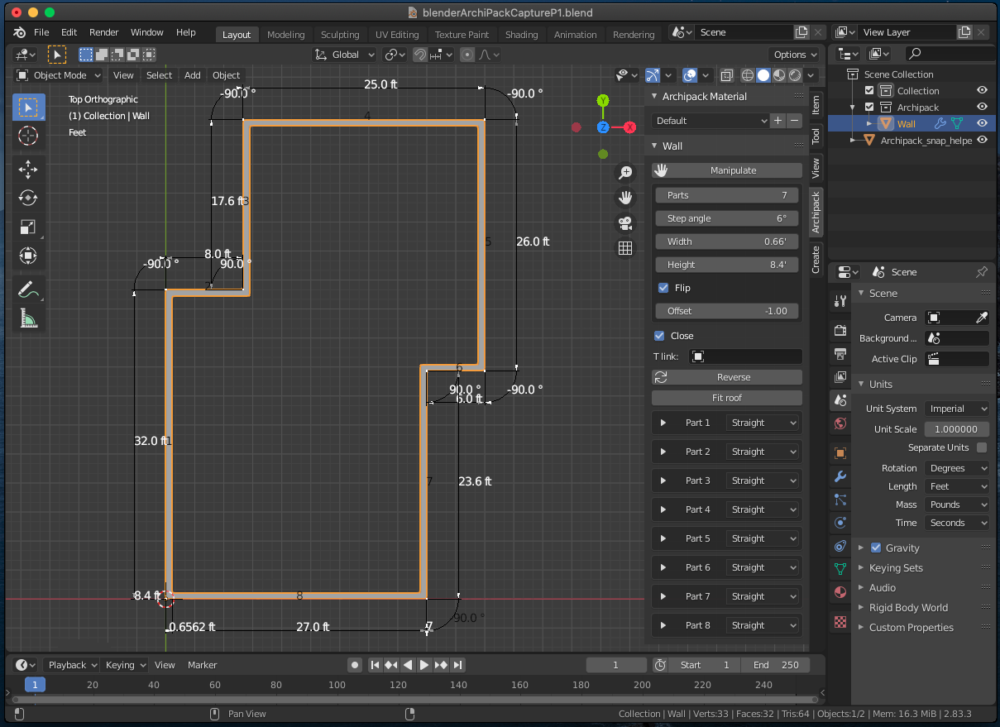
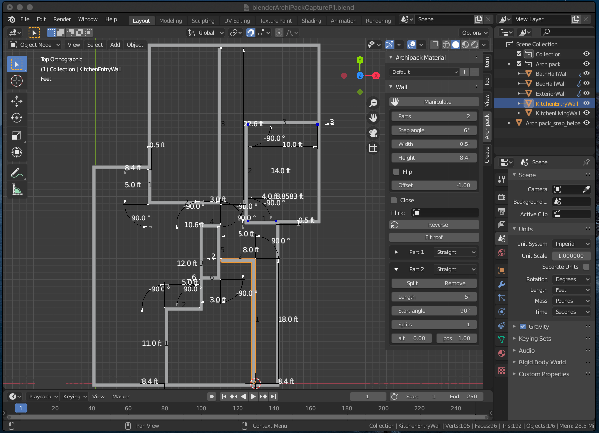
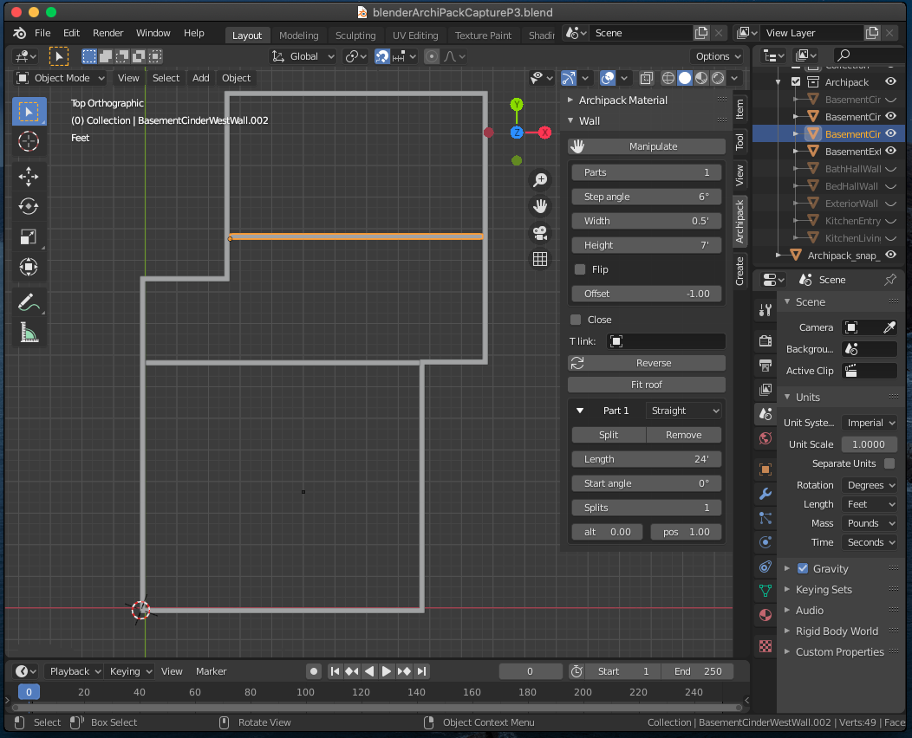

# [ArchiPack](https://blender-archipack.org) House Capture
Using Blender add-on Archipack to capture a house

## Install and simple [tutorial](https://www.youtube.com/watch?v=l-aom9PyosM)
1. Info [blender-archipack.org](https://blender-archipack.org)
2. Install via add-on in Blender 2.8 [TC 1:43](https://youtu.be/l-aom9PyosM?t=103)
    - Edit -> Prefernces -> Search "archi"
    - Click "Add Mesh Archipack"
3. Verify new Add-on by adding a wall
    - Add -> Mesh -> Archipack -> Wall
    - Shift-A -> M (Mesh) -> A (Archipack) -> W (Wall)
4. Set units to Feet
    - Scene -> Units: Imperial - Length: Feet [TC 2:49](https://youtu.be/l-aom9PyosM?t=169)
    - Edit values by clicking on them [TC 3:00](https://youtu.be/l-aom9PyosM?t=180)
5. Add Exterior Walls
    - Create exterior parmeter walls
    - Type N to bring up Tool panel, Click on Archipack tab
    - Edit geometry to each wall segmemt through Tool Panel 'Part' or 'Click Edit' in viewport
    - Add new segment by increase the Parts count in Tool Panel or click the arrow in the view port
    - At the 7 segment, I clicked "Close" in the view port to add segment 8 and close the exterior wall objec
    - Save as blenderArchiPackCaptureP1.blend
    - Screen Shot 
6. Add Interior Walls
    - Object Mode: Select Wall Object
    - Name the Wall Object: ExteriorWall
    - Manipulate -> Width: 0.5 (set wall thickness to 0.5 feet)
    - G X -.5 Enter G Y -.5 Enter to move orgin to INSIDE
    - Shft-A M A W (add new wall segment)
    - Add KitchenLivingWall
    - Add KitchenEntryWall
    - Add BathHallWall
    - Add BedHallWall
    - Save as blblenderArchiPackCaptureP2.blend
    - Screen Shot 
7. Add Basement and Cinder Support Walls
    - Turn off view of all
    - Select ExteriorWall
    - Shft-D
    - G Z -10 Enter
    - Name: BasementExteriorWall
    - Shft-A M A W (add wall) 
    - G Z -10 Enter
    - G Shfit-Z move into place
    - Name: BasementCinderWestWall
    - Shft-A M A W (add wall) 
    - G Z -10 Enter
    - G Shfit-Z move into place
    - Name: BasementCinderEastWall
    - Save as blenderArchiPackCaptureP3.blend
    - Screen Shot 
    - Correct some missing walls
    - Save as blenderArchiPackCaptureP3a.blend
    - Attempt windows and doors projections
    - Save as blenderArchiPackCaptureP3b.blend
    - Save as blenderArchiPackCaptureP3c.blend

7. Add windows and doors.
    - ArchiPack uses a Reference Object to project the doors and windows.  The problem is with the current interior walls they are not relitive to the wall exterior wall ArchiPack reference object.  Basically they created a projector for each wall that did not source itself from the origninal wall reference object.  I think I'll end up having to redo the interior walls eventually.  The ArchiPack mod tools do best when they have a single Reference Pobject.
    - attempt to add toilet
    
    
## Other
- [blender-archipack.org ArchiPack](https://blender-archipack.org)
- [Stephen Leger - ArchiPack Guy](https://www.youtube.com/c/StephenLeger/videos)
    - [Quickstart Walls](https://www.youtube.com/watch?v=JV3S84oDN0Y)
    - [Create internal walls](https://www.youtube.com/watch?v=Oy_ij1tOZgU)
    - [Quickstart Windows](https://www.youtube.com/watch?v=lkzMX0o_Lmk)
- [Floor Plan Part 1](https://www.youtube.com/watch?v=eiDVmoecTw4)
- [Floor Plan Part 2](https://www.youtube.com/watch?v=YdpiSFWC4UQ)
- [ArchiMesh](https://www.youtube.com/watch?v=XiDnW3AwISk)
- [CAD for Blender](https://www.youtube.com/watch?v=tUU5D13nBJs)
- [Snapping in Blender](https://www.youtube.com/watch?v=0p06F1LzTjQ) good for alignment of objects
- [Cutters in Blender](https://www.youtube.com/watch?v=ADiqhdBF-WY)
- [Model a toilet](https://www.youtube.com/watch?v=AQLNMRJiaIU)
- [openvisualfx.com](https://openvisualfx.com/)
- Some good ArchiPack Examples [ThilakanathSudios - Youtube](https://www.youtube.com/c/ThilakanathanStudios/videos)
    - [Arch Video Tour Example - ThilakanathSudios](https://www.youtube.com/watch?v=p_Z0HPfE-rY)
    - [ArchiPack Demo](https://www.youtube.com/watch?v=qnFb_4xVGW8)
