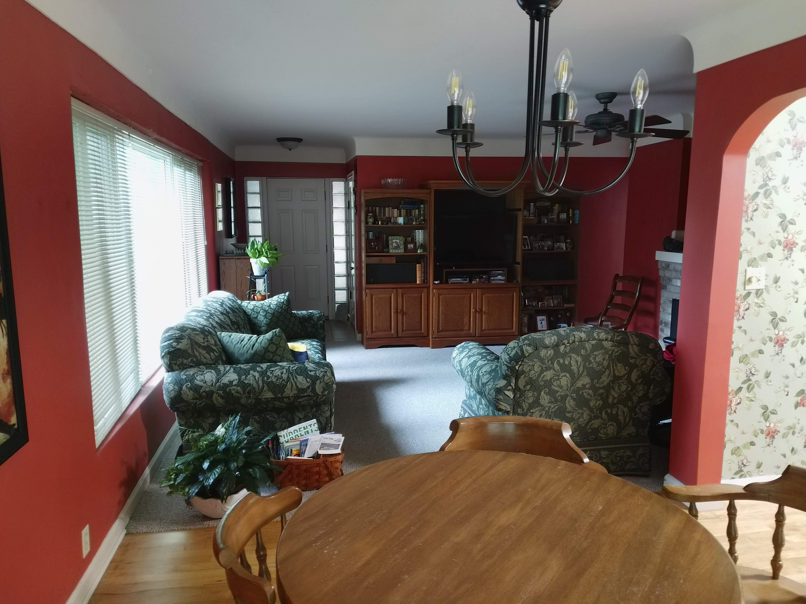
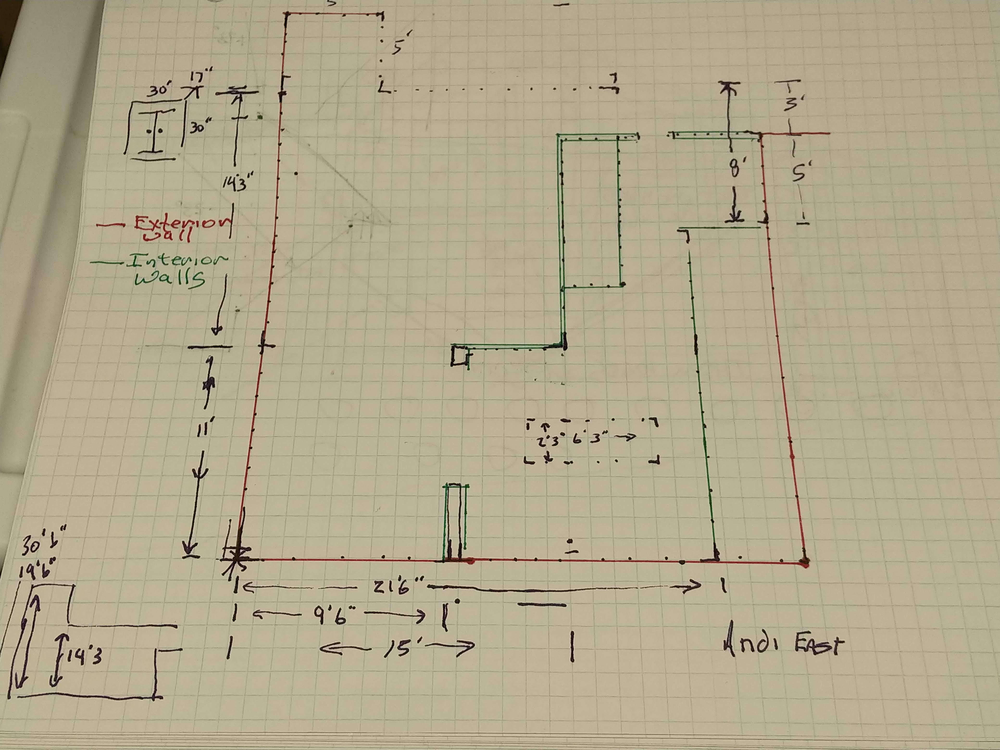

# Architecture Room Capture
Capture an existing room in Blender using reference photos

## Living Room
1. Take some photos and measurements.  I use the measurements to better match to blender measurements for future use.
    - Reference Photo 
    - Reference Measurements 
2. Load Photo into [fSpy](https://fspy.io/tutorial/) I used [fSpy v1.0.3 dmg - mac](https://github.com/stuffmatic/fSpy/releases/tag/v1.0.3) [fSpy github](https://github.com/stuffmatic/fSpy-Blender)
    - Open fSpy
    - Drag Photo into fSpy
    - Align X and Y
    - Put at in a 'good spot' I used transition to carpet
    - Save file as LivingRoomSECorner.fspy
3. Load LivingRoomSECorner.fspy into Blender
    - Open Blender, Delete object, camera light
    - Set Scene -> Units -> Unit System: Imperial
    - Edit -> Preferences -> Add-ons -> Install -> [fSpy-Blender-1.0.3.zip](https://github.com/stuffmatic/fSpy-Blender/releases/tag/v1.0.3l)
    - Enable fSpy Addon
    - File -> Import -> fSpy -> LivingRoomSECorner.fspy
    - Blender crashed on me
    
## References
- [Recreate Your Living Room in Blender](https://www.youtube.com/watch?v=K5IZat91e20)
- [fSpy Tutorial](https://fspy.io/tutorial/)
- [fSpy github ](https://github.com/stuffmatic/fSpy)
- [fSpy github Blender](https://github.com/stuffmatic/fSpy-Blender)
- [fSpy v1.0.3 dmg - mac app](https://github.com/stuffmatic/fSpy/releases/tag/v1.0.3)
- [imeshh - Blender Models](https://www.imeshh.com/)
- [t]()
